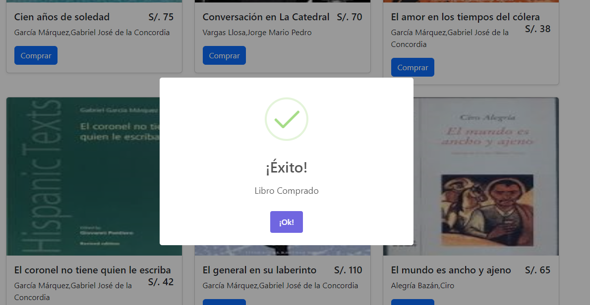

# Tienda con FLask


## crear entorno virtual en mac o linux 
```bash 
virtualenv -p venv venv
```

## crear entorno virtual en windows 
```bash 
python -m venv venv
```
## activar el entorno virtual
```bash 
venv\Scripts\activate
```
### si deseas desactivar 
```bash 
deactivate
```

## instalar Flask
```bash 
pip install flask
```

### crear archivo para convertir todo en paquete 
```
app/__init__.py
```

### tips cuando escribimo codigo 
para formatear el código 
" alt + shift + f"  esto te pedira instalar si no lo tienes 

## instalar flask script
para manejar el proyecto 
```bash
pip install flask-script
```

## levanta el servidor principal

```bash
python manage.py runserver
```

## solucion a error con manager de flask-script
```bash
pip install flask-script==2.0.5
```
ahora sí 
```bash
python manage.py runserver
```

## para evitar vulnerabilidad en pagina en formularios
```bash
pip install FLask-WTF
```

## instalar modulos para base de datos 
```bash
pip install mysqlclient flask-mysql flask-mysqldb
```

## instalar modulos para envio a correo electronico 
```bash
pip install flask_mail python-decouple python-dotenv
```
# pantallazos 
## login usuario 


## comprando un libro


## Lista de mis libros comprados 


## usuario Administrador ve que libros se vendieron 
